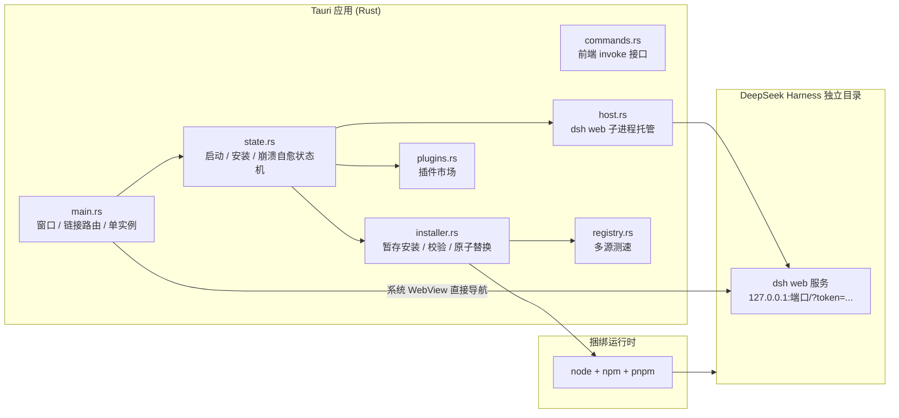

# 从 C#/WinUI 到 Rust + Tauri —— 桌面端 1.0 大重写

> 项目开源地址(欢迎 Star ⭐):

::github{repo="having5548/deepseek-harness-desktop"}

## 🔁 为什么要推倒重来

上一版(0.7.x)把 DeepSeek Harness 的 Web UI 包进了一个原生窗口,该有的功能都有了。但心里一直有两个疙瘩:

1. **它只跑 Windows。** 整个壳是 C# + WinUI 3 写的,Mac 和 Linux 用户完全用不了;
2. **它背着一个约 200MB 的 .NET 运行时。** 明明只是一个"拉起本地服务 + 内嵌 WebView"的壳,却要拖着这么重的行李。

于是干脆推倒重写:**用 Rust + Tauri 2 重做整个桌面壳**,一次性把跨平台和体积问题都解决掉。版本号从 0.7.2 直接跳到 **1.0.0**,如今已迭代到 **1.0.3**——功能与旧版完全对齐,还多了一堆只有重写才能做的改进。

## 🧱 技术栈换了什么

| 维度 | 旧版(0.7.2) | 新版(1.0.x) |
|---|---|---|
| 应用外壳 | C# / WinUI 3 | **Rust / Tauri 2** |
| WebView | WebView2 | 系统 WebView(Windows WebView2 / macOS WKWebView / Linux WebKitGTK) |
| 平台 | 仅 Windows | **Windows / macOS / Linux** |
| 随包运行时 | ~200MB .NET + Windows App SDK | 原生二进制,**零 .NET** |
| 数据目录 | `%APPDATA%\DshDesktop` | **沿用旧目录**,用户数据无缝继承 |

重写规模:桌面壳全部逻辑用 Rust 重新实现,核心约 **2600 行**,配了 **31 个单元测试**(semver 比较、暂存安装校验、版本偏斜检测、shim 解析、符号链接安全删除、崩溃检测、插件来源解析)。

## 🏗️ 新架构



Rust 侧的模块划分基本是旧版 C# 服务的"一对一移植":

| 模块 | 职责 |
|---|---|
| `main.rs` | 入口:主窗口、链接路由、单实例锁 |
| `state.rs` | 启动 / 安装 / 升级 / 崩溃自愈状态机 |
| `commands.rs` | Tauri 命令层(前端 `invoke` 接口) |
| `host.rs` | `dsh web` 子进程管理、鉴权 URL 解析、进程树清理 |
| `installer.rs` | 暂存安装 / 校验 / 整体替换 / 模块回退缓存自愈 |
| `registry.rs` | npm 多源并行测速 |
| `plugins.rs` | 插件市场多来源抓取 / 去重 / 屏蔽恢复 |
| `paths.rs` / `settings.rs` / `version.rs` | 跨平台路径、设置、简化 semver |

## 🎯 重写路上真正踩到的坑

### 1. 鉴权 Cookie 是 `SameSite=Strict`,iframe 方案直接判死刑

最反直觉的一条:**主窗口不能用 iframe 套壳。** dsh web 的鉴权 cookie 是 `SameSite=Strict` 的,跨站 iframe 永远带不上这个 cookie。所以 WebView 必须**直接停在 dsh 服务页面上**,而不是"外层套一个自己的页面、里面 iframe 嵌服务"。

这直接决定了整个 UI 架构:**原生菜单被移除,应用自己的工具栏只能"注入"到 dsh 页面里**。

### 2. 工具栏怎么和应用通信?用 RFC 2606 的哨兵主机名

新问题来了:工具栏脚本运行在 `http://127.0.0.1:<port>` 这个**远端来源**上,而 Tauri 的 IPC capability 只授权本地来源——远端页面根本调不到 `invoke`。

解法很巧:定义一个永远不会被解析的哨兵地址,按钮请求全走它。

```js
// toolbar.js:向 Rust 侧投递动作(不会真的弹窗)
window.open('https://dsh-desktop.invalid/plugins', '_blank', 'noopener');
```

Rust 侧在 `on_navigation` / `on_new_window` 里识别这个主机名,把它翻译成真正的动作,并拦掉窗口请求:

```rust
const ACTION_HOST: &str = "dsh-desktop.invalid"; // RFC 2606 保留后缀

fn toolbar_action_for(url: &Url) -> Option<String> {
    let is_action_host = url.host_str()
        .map(|h| h.eq_ignore_ascii_case(ACTION_HOST)).unwrap_or(false);
    if !is_action_host { return None; }
    let action = url.path().trim_matches('/').to_string();
    (!action.is_empty()).then_some(action)
}
```

因为给远端来源开 IPC 权限是危险的,这样既能通信,又完全不用放松权限。工具栏本身是一枚**固定在顶部中央的毛玻璃胶囊**(后退/前进/刷新 · 重连/浏览器打开 · 插件/设置/日志 · 检查更新),挡路时点箭头可收成一个小手柄,并跟随系统深/浅色。

### 3. "链接点了没反应":补上 `on_new_window` 这层

移植时漏掉了旧版 WebView2 `NewWindowRequested` 的等价实现,结果 dsh 页面里 `target="_blank"` 的链接被**静默丢弃**——既不开系统浏览器,也不开新窗口,看起来就是"点不动"。

1.0.3 把 `on_navigation` 和 `on_new_window` 都接管了:外部 http(s) 一律交给系统浏览器并在应用内阻止;回环服务与本地页面照常导航。

```rust
// 外部链接 → 系统浏览器,并阻止应用内导航
.on_navigation(move |url| {
    if let Some(action) = toolbar_action_for(url) { dispatch_toolbar_action(&nav_app, &action); return false; }
    if is_local_page(url) { return true; }
    open_in_system_browser(&nav_app, url);
    false
})
```

### 4. 更新完 dsh 反而坏了:版本偏斜 + "暂存安装"

这是旧版一个很隐蔽的坑。应用过去直接装 npm 的 `latest` 标签,但对 dsh 而言 **`latest` 可能比 `next` 更旧**,而 dsh 声明的依赖范围 `^0.1.5-rc.1` 会被 npm 解析到范围内最新的 `rc.2`——于是 CLI 停在旧版、所有插件包升到新版,运行时插件立刻加载失败。

现在 `installer.rs` 会解析出**确切版本号**再安装:

```rust
/// 取 latest 与 next 中较新者,并且必须是确切版本号
pub fn resolve_version(dist_tags: &Value) -> Option<String> {
    let mut best: Option<String> = None;
    for tag in ["latest", "next"] {
        if let Some(c) = dist_tags.get(tag).and_then(Value::as_str) {
            if !is_exact_version(c) { continue; }
            if best.as_deref().map(|b| compare_versions(c, b) == Ordering::Greater).unwrap_or(true) {
                best = Some(c.to_string());
            }
        }
    }
    best
}
```

同时安装方式也从"就地 `npm install`"改成了 **暂存 → 校验 → 整体替换**:

1. 先装到独立暂存目录 `.staging-<时间戳>`;
2. `verify_tree` 校验版本一致、且不存在比 CLI 更新的插件包(即无版本偏斜);
3. 通过后整体替换安装根目录,失败自动回滚,绝不留"半新半旧";
4. 更新前先把 dsh 进程树彻底停掉,避免 Windows 文件锁冲突。

### 5. "更新后必须删光重装"的真正原因:模块回退缓存

dsh 并不把自己的 in-box bundles 装进 profile,而是用 `$DSH_HOME/profiles/node_modules` 这个**符号链接农场**把依赖闭包暴露给每个 profile。替换安装目录后链接可能缺失或悬空,profile 就解析不到,启动报 `Cannot find package '@deepseek-ai/dsh-client-ui-…'`。

现在每次安装/升级成功都会重置该缓存,启动自检也会校验它并自动清除——**逐项删除链接、绝不递归跟进符号链接**,所以永远不会误删真实安装目录。那个"更新后必须手动删光 `%USERPROFILE%\.dsh`"的祖传偏方,终于可以退休了。

### 6. 一个子进程都不许弹窗

GUI 程序启动控制台子进程(node/npm/pnpm)默认会闪出黑框。1.0.2 审计了**所有**进程创建点(dsh 服务 / npm / dsh plugin / taskkill / tasklist),统一加 `CREATE_NO_WINDOW`,并让主程序**无条件使用 GUI 子系统**——连 debug 构建都不带控制台窗口,前台永远只有应用主窗口。

### 7. 退出不留残留

退出应用时必须**同步**终止整棵 dsh 子进程树(如果丢到后台线程,主进程可能在 `taskkill` 完成前就退了,进程树就残留了——实测踩过的坑):

- Windows:`taskkill /PID <pid> /T /F`;
- Unix:子进程放在独立进程组里(`process_group(0)`),直接 `kill(-pgid, SIGKILL)` 整组带走。

### 8. 换了盘也别重复下载

新版默认把 dsh 装到**应用所在盘**的 `DeepSeek Harness` 目录。但它还会扫描其他盘符,若发现已有旧安装(比如旧 C# 版装在 H 盘、新版装到 C 盘)就直接复用,而不是重新下一份。Linux/macOS 则统一在 `~/.local/share/DeepSeek Harness`,可用 `DSH_INSTALL_ROOT` 覆盖。

## 📦 跨平台构建与分发

| 平台 | 产物 |
|---|---|
| Windows 10/11 x64 | Inno Setup 安装器(无需管理员权限)+ 免安装版 |
| Ubuntu 22.04+ / Debian 12+ / UOS 1070 / deepin 23 | `.deb`(依赖 `libwebkit2gtk-4.1-0`、`libgtk-3-0`) |
| macOS(Apple Silicon) | `.dmg`(未签名,首次需右键打开) |

构建细节上也做了几个取舍:

- **静态链接 rustls**,Linux 包不依赖系统 OpenSSL;
- **pnpm 固定 11.x**:pnpm 12+ 会以 9 份各约 42MB 的重复二进制塞进包,把运行时从约 19MB 膨胀到约 398MB;
- **`Cargo.toml` release 优化**:`strip = true` + `lto = true` + `codegen-units = 1`,二进制尽量小;
- 三平台 GitHub Actions 矩阵(`.github/workflows/build.yml`)自动构建并上传产物。

## 🕰️ 1.0.x 版本速览

- **1.0.0** —— 整体重写为 Rust + Tauri 2,首次跨平台;功能与 0.7.2 对齐;31 个单元测试;
- **1.0.1** —— 修复子进程控制台闪窗;支持跨盘复用旧安装;
- **1.0.2** —— 无条件 GUI 子系统,前台保证只有应用窗口;
- **1.0.3** —— 修复外链打不开;原生菜单换成注入式毛玻璃悬浮工具栏。

## 📥 上手

1. 在用户主目录创建 `.env`:`DEEPSEEK_API_KEY=sk-xxxx`
2. 到 [Releases](https://github.com/having5548/deepseek-harness-desktop/releases) 下载对应平台安装包
3. 双击打开,首次启动自动装好 dsh,之后就当普通软件用

## 💭 一点感想

把 C#/WinUI 换成 Rust + Tauri,最直观的收益是**体积**和**跨平台**;但真正花时间的是那些平台无关的业务逻辑——鉴权 Cookie 的约束、npm 版本偏斜、符号链接缓存、进程树与窗口的清理。这些问题不会因为换了语言就消失,反而因为"要从零重实现一遍"被逼着彻底想清楚了。

现在这一版已经在 Windows / Ubuntu / macOS 上跑通,欢迎下载试用、提 Issue。如果你也想把自己的 CLI 工具包成桌面应用,这套"系统 WebView 直接导航 + 注入式工具栏 + 哨兵主机通信"的思路,可以直接拿去抄作业 😄
