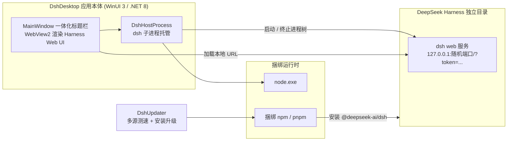
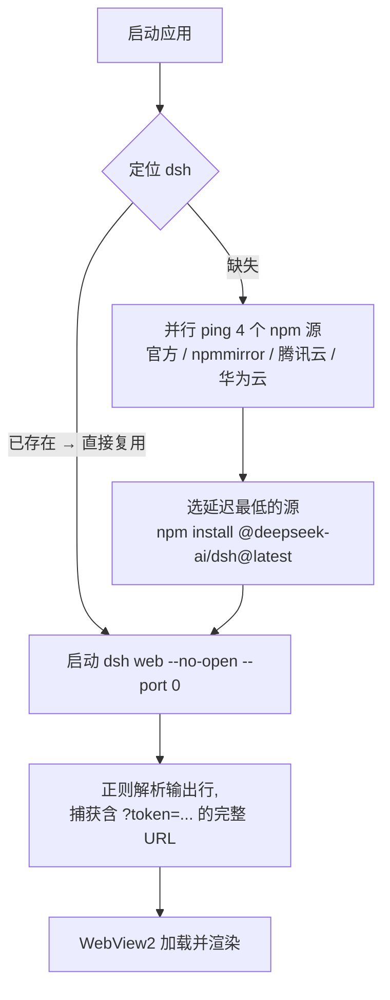

# 我把 DeepSeek Harness 装进了原生 Windows 窗口

> 项目开源地址(欢迎 Star ⭐):

::github{repo="having5548/deepseek-harness-desktop"}

## 🎯 为什么要做这个

DeepSeek Harness(`dsh`)本身是一个非常优秀的 CLI 工具,`dsh web` 能直接拉起一个带完整 Web UI 的本地服务。但对绝大多数不熟悉命令行的用户来说,让 TA 先去装 Node.js、再 `npm i -g @deepseek-ai/dsh`、再敲 `dsh web`……门槛实在太高了。

于是我想:**能不能把它包装成一个"双击就能用"的普通 Windows 软件?**

用户不用懂任何 CLI,安装完点开图标,一个原生窗口里就跑着完整的 DeepSeek Harness。这就是 **DshDesktop** 的由来——一个用 **WinUI 3 + WebView2** 打造的桌面壳。

## 🏗️ 整体架构

核心思路非常简单:应用在后台拉起一个 `dsh web` 服务进程,再用 WebView2 把本机地址渲染进原生窗口。



所有关键逻辑都收敛在 `Services/` 下的几个类里:

| 服务类 | 职责 |
|---|---|
| `DshHostProcess.cs` | 拉起/终止 `dsh web`、解析鉴权 URL、崩溃检测 |
| `DshLocator.cs` | dsh 定位:自动安装目录 → 用户设置 → PATH/npm 全局 |
| `DshUpdater.cs` | dsh 安装/升级:多源测速、进度、取消、超时兜底 |
| `DshPaths.cs` | 路径常量(捆绑运行时、dsh 安装根) |
| `PluginManager.cs` / `PluginDialog.cs` | 插件命令与多来源插件市场 |
| `AppSettings.cs` / `SettingsDialog.cs` | 设置持久化与手动指定 dsh 路径 |

## 🪄 设计亮点与实现细节

### 1. 零 CLI 前置:首次启动自动装好 dsh

目标机器上可以什么都没有。安装包只自带一个 Node.js 运行时(`runtime/node.exe` + npm/pnpm),**连 dsh 都不捆绑了**(v0.7 起)——它由应用在用户机器上首次启动时自动安装。



实现上有几个细节值得一提:

- **多源测速**:`DshUpdater` 里维护了 npm 官方 / npmmirror / 腾讯云 / 华为云四个源,并行请求各自的 `-/package/@deepseek-ai/dsh/dist-tags`,谁延迟低用谁,顺带把 dist-tags 拿回来,避免重复请求。国内网络环境下依旧稳定。
- **进度可取消、超时兜底**:npm 输出实时流式显示在黑底启动日志里,取消会终止整棵进程树,另有 15 分钟超时,绝不会无限卡死。
- **独立的安装位置**:dsh 被装到应用所在盘根的 `DeepSeek Harness` 文件夹,和应用本体隔离。这样应用升级/重装都不会碰坏 dsh,而 dsh 想升级时点工具栏「检查更新」即可。
- **解析顺序兜底**:自动安装目录 → 设置里手动指定的路径 → PATH/npm 全局,层层回退。

### 2. 子进程托管:端口零冲突、鉴权不失败

`DshHostProcess` 负责拉起服务:

```csharp
// 以 --port 0 启动,让系统分配空闲端口,永不冲突
psi.ArgumentList.Add("--profile");
psi.ArgumentList.Add("web");
psi.ArgumentList.Add("--no-open");
psi.ArgumentList.Add("--port");
psi.ArgumentList.Add("0");
```

注意两点:
- **工作目录设为用户主目录**,这样 `dsh` 才能读到用户级 `.env` 里的 `DEEPSEEK_API_KEY`,无需在 GUI 里再录一遍 Key。
- **完整捕获鉴权 URL**:dsh 0.1.2 起输出的 URL 会带 `?token=...`,我用一行正则把整条 URL(含 query)抓下来再交给 WebView 加载,否则会撞上烦人的 `dsh web authentication required`。

```csharp
private static readonly Regex UrlPattern = new(@"dsh web: (http://127\.0\.0\.1:\d+\S*)", RegexOptions.Compiled);
```

### 3. 崩溃自愈:插件搞崩服务也不怕

Harness 的生态核心是插件,而一个坏插件能让服务直接崩掉。我在 stderr 缓冲里做了崩溃特征识别:

```csharp
private static readonly Regex PluginListPattern = new(@"plugin\(s\) failed to load:\s*(.+?)(?:;|$)", RegexOptions.Compiled);
private static readonly Regex PluginEntryPattern = new(@"failed to apply loader entry\s+\S+\s+\(([^)]+)\)", RegexOptions.Compiled);
```

一旦匹配到 `plugin tree failed to load` / `fatal load failure` 等特征,就自动:识别出肇事插件 → 卸载它 → 用安全配置重启服务 → 弹窗把插件名和最近 60 行日志一起展示,用户可「一键重启」或「恢复该插件」。坏插件既不会拖垮服务,也不会被冤枉。

### 4. 插件市场:多来源、去重、离线缓存

v0.5 把插件发现做成了"多源聚合":**DSH Market / npm 官方 / npmmirror** 三个来源,支持单来源与多源叠加切换;同一插件按 **GitHub 仓库链接 + 作者** 智能去重合并;列表持久化为本地 JSON 缓存,全部源都挂掉时还能看上次的列表;搜索还支持**正则表达式**。装完插件服务自动重启。

### 5. 收尾不留痕

退出应用时不是简单 Kill 主进程——用 `taskkill /PID <pid> /T /F` 把整棵子进程树连根拔掉,`dsh`、node 以及它派生的任何进程一个都不剩。

### 6. 原生质感:一体化标题栏 + 启动日志控制台

v0.6 之后,窗口内容延伸到标题栏,导航和应用操作合并成一条可拖动的现代顶栏;启动阶段下方有一个黑底终端风格的日志面板,实时流式显示 dsh/Node 输出——一旦出错,原因当场可见,而不是只在右上角默默把"正在启动"改成"服务已退出"。

## 🧱 打包与分发

- **目标框架** `net8.0-windows10.0.19041.0`,`WindowsPackageType=None`(unpackaged,免 MSIX);
- **`WindowsAppSDKSelfContained=true` + `--self-contained true`**:.NET / Windows App SDK 运行时全部随包分发,目标机器啥都不用装;
- **Inno Setup 安装器**:开始菜单 + 桌面快捷方式 + 卸载程序,**无需管理员权限**;
- **构建脚本可移植**:`dotnet` / `node` / `npm` / `iscc` 全部从 PATH 解析,不再写死工具路径,一键 `scripts/build.ps1` 全流程出包。

## 🕰️ 版本演进(挑重点)

- **v0.1**:首个版本,捆绑 Node + dsh,插件市场、崩溃自愈、自包含发布就位;
- **v0.4**:多源自动择优,支持手动「检查更新」、实时进度 + 取消 + 15 分钟超时;
- **v0.5**:插件市场多源化(DSH Market / npm / npmmirror)、智能去重、离线缓存、正则搜索;
- **v0.6**:一体化标题栏 + 黑底启动日志控制台;
- **v0.7**:不再捆绑约 **110MB** 的 dsh,改为首次启动自动安装最新版并绑定独立目录;完整捕获鉴权 URL,修复 dsh 0.1.2 的认证问题。

其中 v0.7 是最重要的一次取舍:发布包瘦身、dsh 永远是最新版、和应用本体解耦,代价是把"首次联网安装"的复杂度转移给了运行时——用多源测速 + 清晰的状态提示把体验兜了回来。

## 📥 想试试?

1. 在用户主目录创建 `.env`:`DEEPSEEK_API_KEY=sk-xxxx`
2. 到 [Releases](https://github.com/having5548/deepseek-harness-desktop/releases) 下载 `DshDesktop-Setup-0.7.0.exe` 安装(或解压免安装版)
3. 双击桌面图标,首次启动会自动装好 dsh,然后就当普通软件用

遇到问题欢迎提 Issue;如果你也想要一个"命令行工具 → 原生桌面应用"的壳,这套 WinUI 3 + WebView2 + 子进程托管的思路可以直接抄作业 😄
