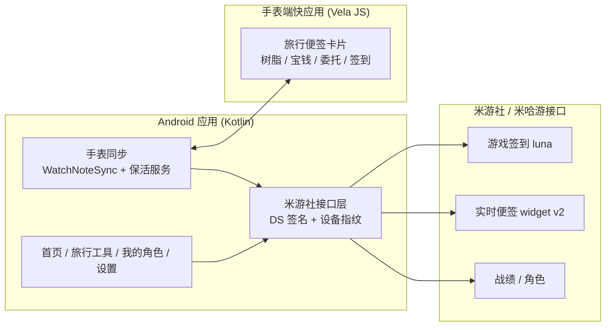

# 旅行者便签：把原神签到和实时便签塞进手表

> 项目开源地址(欢迎 Star ⭐):

::github{repo="having5548/TravelerNote"}

> 📦 手表端小程序已上架米坛社区:[小程序 - 旅行者便签 V1.19](https://www.bandbbs.cn/resources/8072/)

## 🎒 又开了个新坑

每天的原神日常里,有两件小事特别容易忘:一次游戏签到,和看看树脂还剩多少。手机上虽然有各种工具,但**抬手看一眼手表**显然更省事。

于是有了 **TravelerNote(旅行者便签)**——一个 Android 应用,外加一个跑在 **REDMI Watch 5** 上的手表端快应用:

- 手机端:米游社登录 + 原神每日签到 + 实时便签 + 角色面板 + 游戏资讯;
- 手表端:抬手就能看到**原粹树脂(带回满时刻)/ 洞天宝钱 / 探索派遣 / 每日委托 / 本月签到天数**,最多支持 5 个账号切换。

两端通过**小米穿戴互联**打通,手机负责拉数据,手表负责显示,数据全程只读。

## ✨ 手机端都做了什么

- **游戏签到全自动**:打开 App 就跑一次原神 luna 签到,已签到 / 首次绑定 / 需要验证都会在首页状态行说明;
- **社区签到是手动的**:只在首页点「社区签到」按钮时执行,绝不会自动触发论坛签到;
- **旅行日历**:按「本月第 N 次签到」列出每天的奖励,已领取 / 今日 / 未领取三态一眼可辨;
- **实时便签**:原粹树脂、洞天宝钱、探索派遣、每日委托(widget v2 接口);
- **我的角色**:等级、武器、面板属性、圣遗物主副词条、天赋等级,数据直接走官方战绩接口;
- **多种登录**:扫码登录(本地 zxing 渲染二维码)、手机号验证码、手动粘贴 Cookie;
- **外观**:6 色主题强调色、明暗跟随系统、可选背景图(每日随机 / 必应每日一图),磨砂 / 亚克力材质;
- **游戏资讯**:官方活动日历 + UP 池 + 游戏公告,另有 B 站来源的原神官方投稿与动态。

## ⌚ 重头戏:手表端小程序

手表端是一个用 **Vela JS / AIoT-toolkit 2.0** 构建的快应用,视觉与手机端实时便签完全一致——同一套图标矢量、同一套强调色(树脂蓝 / 宝钱金 / 委托绿 / 签到紫)。



几个用起来很舒服的细节:

- **树脂本地推算**:手表按每 480 秒回 1 点自己重算当前值与「回满 HH:mm」,**断连也持续走准**;回满瞬间还会弹「原粹树脂已回满」提示。
- **本地缓存 + 离线回退**:每次同步成功自动落盘,连不上手机时用缓存数据展示,状态栏黄色提示「离线 · 显示缓存数据」。
- **极致轻量**:事件驱动**无轮询**、无定时器常驻(只有展示时每分钟一次本地计算),rpk 约 **86KB**。
- **多账号(最多 5 个)**:卡片底部 `‹ 账号名 n/m ›` 切换条(复用树脂回满那一行,不额外占屏),点 `⋯` 还能打开账号名册直接选;当前选择落盘,被杀 / 重启 / 断连后仍停在同一个账号。**切换只影响手表显示,不会远程改动手机端的当前账号。**

## 🔧 技术实现里几个有意思的点

### 1. 手表同步怎么打通

配对有**硬约束**:手表快应用包名必须等于安卓包名(`com.traveler.miyou`),且 rpk 必须用**同一套签名**。手机端集成官方 **xms-wearable SDK**,首次发送自动申请 `DEVICE_MANAGER` 权限。

消息是经蓝牙转发的 JSON 文本,协议已经演进到 **v3**:

```json
{
  "type": "dailyNote", "v": 3, "date": "2026-09-19", "ts": 0,
  "active": "accountId", "count": 2, "skipped": 0,
  "accounts": [
    { "id": "…", "label": "…", "uid": "…",
      "resin": { "cur": 120, "max": 160, "rec": 3600 },
      "coin": { "cur": 1000, "max": 2400 },
      "task": { "cur": 3, "total": 4 },
      "sign": { "today": true, "days": 12 } }
  ]
}
```

设计上留了兼容:单个账号拉取失败**只在该条目写 `error`**,不连累其他账号;同时把当前账号的字段在顶层再放一份,只认 v2 的旧手表端也能用。手表还可以发 `requestNote` 主动拉取,手机端自动回发;`storageInfo` 则回报版本 / 构建时间 / 存储占用。

### 2. 三种保活方式,和"杀不死的看门狗"

后台保活是 Android 老大难。手表同步提供三种模式:

1. **快捷设置磁贴**(无感静默);
2. **常驻通知**(低频通道,不重复响铃,通知上直接带「关闭同步」);
3. **Shizuku 守护**(shell 权限 `am start-foreground-service`,绕过后台启动限制)。

而真正兜底的是一个**一次性精确闹钟看门狗**:每次触发先重排下一次(`setExactAndAllowWhileIdle`,无权限时退回 `setAndAllowWhileIdle`),**服务被杀后闹钟依然保留**,到点自动把服务拉回来;用户关掉同步才取消。再加上开机 / 覆盖安装广播恢复,以及每次打开 App 的自检——"闹钟丢了 + 服务被杀"两个问题叠加导致再也起不来的情况,被堵死了。

### 3. 接口对齐胡桃工具箱

战绩 / 角色数据全部对齐 [Snap.Hutao(胡桃工具箱)](https://github.com/DGP-Studio/Snap.Hutao) 的 `GameRecordClient`:DS 用 X4 盐 Gen2 且参与签名的 query 按字母序重排,设备指纹先本地随机 13 位 hex、再经 `device-fp/api/getFp` 注册并缓存 7 天(未注册的指纹几乎必然被风控判为异常环境,返回 `5003`)。遇到 `1034` 人机验证会自动走 `createVerification → 极验 → verifyVerification` 换回 challenge 重试。

### 4. B 站动态:在浏览器上下文里"截胡"

B 站的空间动态接口加了风控,不带登录态的请求一律 `-412`。于是改用**隐藏 WebView** 打开官方动态页,在页面脚本执行前 hook `fetch` / `XMLHttpRequest`,截下页面自己发出的那次响应(浏览器上下文里带着 B 站自己下发的风控 cookie),裁剪成小 JSON 后交回原生渲染;抓不到就自动退回到无需登录的官方投稿 + 专栏。

## 📅 版本演进

- **v1.1.0**:首个公开版本——签到、实时便签、我的角色、扫码 / 短信 / Cookie 登录;
- **v1.1.3**:新增「旅行工具」页签,原生拉取深境螺旋 / 幻想真境剧诗战绩;
- **v1.1.4**:多账号并行缓存、全屏背景、我的角色改为官方接口;
- **v1.1.5**:新增「游戏资讯」页签(活动 / UP 池 / 公告 + B 站);
- **v1.1.7**:修正元素精通、天赋名称等展示问题;
- **v1.1.8**:**手表同步大功能上线**(手机 ⇄ REDMI Watch 5);
- **v1.1.9**:保活重做 + 「保活自检」与一键权限引导;
- **v1.1.10**:手表端多账号,最多 5 个实时便签可切换。

## 🔐 安全与隐私

- 登录凭证保存在应用私有目录,`allowBackup=false`,已从备份 / 迁移规则中排除;
- 全局禁用明文流量,打码接口只支持 https;
- release 启用 R8 混淆 + 资源裁剪,并移除全部 `Log` 输出;
- 「我的角色」页会把 UID 发送给第三方 `api.lelaer.com` 获取面板数据,介意可不用该页。

## ⚠️ 免责声明

本项目为**非官方第三方工具**,与米哈游 / 上海米哈游影铁科技有限公司及其关联公司无任何关联,未获得任何授权或认可。「米游社」「原神」等名称、商标与游戏素材权利均归米哈游所有。

**自动签到等行为可能违反米哈游的服务条款,可能导致账号被限制、冻结或封禁;请自行评估风险,一切后果由使用者自行承担。** 本项目仅供个人学习与技术研究使用,禁止商业用途。

## 📥 上手

- Android 端:要求 **Android 11(API 30)及以上**,从 [Releases](https://github.com/having5548/TravelerNote/releases) 下载 APK 安装;签名固定,可直接覆盖安装;
- 手表端:到[米坛社区](https://www.bandbbs.cn/resources/8072/)下载安装小程序,再在手机端「设置 → 手表同步」里打开开关即可。

---

许可证为 **GPL-3.0**。如果你也在折腾"手机 App + 穿戴设备"的联动,这套"手机拉数据、手表只读展示 + 看门狗保活"的思路可以直接抄作业 😄
